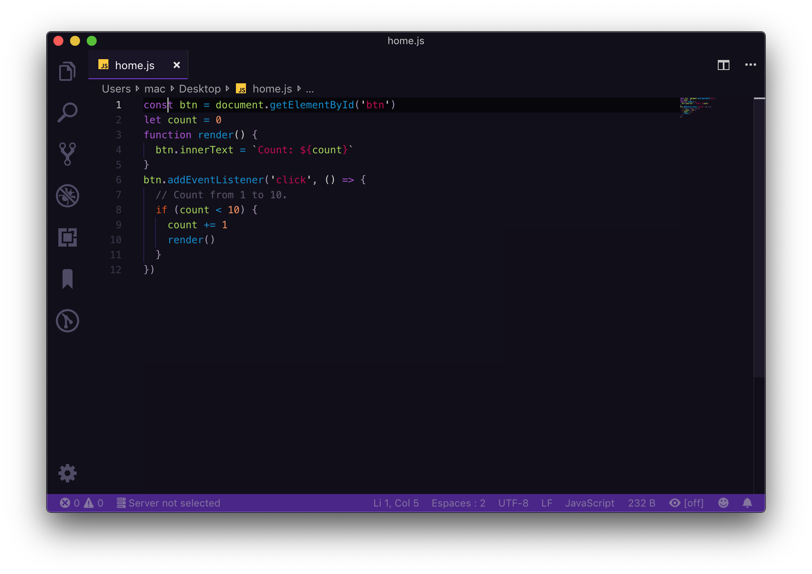

    
    <h2 align="center">Viow Themes</h2>

# Viow Themes

Viow is a collection of light & dark themes with a balanced mix of many warm and cold colors.

## Viow arabian
a touch o some colors from arabian 1001 night,more violet and blue and some red, to give a well blend colors. 

    

## Viow Mars
as its name indicates, it's a contact from space, from red planet mars, a mix for warm colors red and pink

    

### Viow material

    

### Viow light

    

